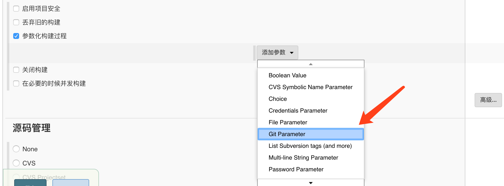
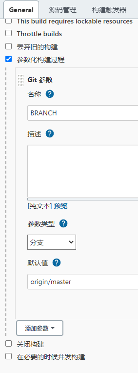

# Jenkins 相关使用记录

## maven配置settings.xml

```shell
docker volume ls
docker volume inspect jenkins_jenkins_home
cd /var/lib/docker/volumes/jenkins_jenkins_home/_data
mkdir -p ./data/maven
code settings.xml
# 复制./conf/settings.xml文件内容
# 修改标签<localRepository>内容
# 调整[系统管理 -> 全局工具配置 -> Maven 配置]
# 默认(和全局) settings 提供 -> 文件系统中的 settings 文件 -> 文件路径(/var/jenkins_home/soft/maven/settings.xml)
```

---

## 多分支参数构建

```shell
# 1. 下载安装插件
# 在管理中选插件，输入Git Parameter
```




---

## 构建maven项目

```shell
# 下载安装插件
# 在管理中选插件，输入
# Maven Integration
# SSH
# Deploy to container 
# Send build artifacts over SSH
```

- 步骤
    
    
    
    
    
    
    
- Build

```shell
# Goals and options
clean install -Dmaven.test.skip=true -Pprivate -Djava.awt.headless=true
```

- send build artifacts over SSH (Transfers Set -> Exec command)

```shell
# 第一版(初版)
imagesid=`docker images|grep -i docker-test|awk '{print $3}'`
project=/var/lib/docker/volumes/jks_jenkins_home/_data/workspace/test4
dockerid=`docker ps -a|grep -i docker-test|awk '{print $1}' `
echo $project
if  [ ! -n "$imagesid" ];then
   echo $imagesid "is null"
else
    docker rmi $imagesid -f
fi
cd $project

echo "FROM tomcat:8.5" > Dockerfile
echo "MAINTAINER Fa" >> Dockerfile
echo "RUN rm -rf /usr/local/tomcat/webapps/*" >> Dockerfile
echo "ADD ./target/*.war /usr/local/tomcat/webapps/" >> Dockerfile
echo "EXPOSE 8080" >> Dockerfile
# echo 'ENTRYPOINT ["/usr/local/tomcat/bin/catalina.sh","run"]' >> Dockerfile

docker build -t docker-test .

if  [ -n "$dockerid" ]  ;then
   docker stop $dockerid
   docker rm -f $dockerid
else
   echo 'dockerid is null'
fi
docker run -itd -p 8080:8080 docker-test
```

```shell
# 第二版
# docker images | awk '{if($1=="$JOB_NAME") print $3}' | xargs docker rmi

dockerid=`docker ps -aq -f ancestor=$JOB_NAME `

if  [ -n "$dockerid" ]  ;then
   docker stop $dockerid
   docker rm -f $dockerid
   docker rmi $(docker images -q -f reference=$JOB_NAME)
else
   echo 'dockerid is null'
fi

cd $DOCKER_WORKSPACE/$JOB_NAME

echo "FROM tomcat:8.5" > Dockerfile
echo "MAINTAINER Fa" >> Dockerfile
echo "RUN rm -rf /usr/local/tomcat/webapps/*" >> Dockerfile
echo "ADD ./target/*.war /usr/local/tomcat/webapps/" >> Dockerfile
echo "EXPOSE 8080" >> Dockerfile
# echo "ENTRYPOINT ["/usr/local/tomcat/bin/catalina.sh","run"]" >> Dockerfile

docker build -t $JOB_NAME .

docker run -itd -p 8280:8080 $JOB_NAME

```

```shell
# 第三版(swarm)
# docker images | awk '{if($1=="$JOB_NAME") print $3}' | xargs docker rmi
# published: 8280 # todo 映射端口根据实际调整

export app_version='1.0'

docker service rm app_$JOB_NAME

cd $DOCKER_WORKSPACE/$JOB_NAME

# 编辑Dockerfile文件
echo "FROM tomcat:8.5.71-jdk8-corretto" > Dockerfile
echo "MAINTAINER Fa" >> Dockerfile
echo "RUN rm -rf /usr/local/tomcat/webapps/*" >> Dockerfile
echo "ADD ./target/*.war /usr/local/tomcat/webapps/" >> Dockerfile
echo "EXPOSE 8080" >> Dockerfile

# 构建镜像
docker build -t $JOB_NAME:$app_version .

# 删除空镜像
docker images | awk '{if($1=="<none>")print $3}' | xargs docker rmi 

# 编辑stack yml文件
tee $JOB_NAME.yml <<-'EOF'
version: '3.5'
services:
  $JOB_NAME:
    image: $JOB_NAME:${app_version}
    ports:
      - target: 8080
        published: 8280
        mode: host
    networks:
      - middleware
    deploy:
      replicas: 1
      update_config:
        parallelism: 1
      restart_policy:
        condition: on-failure

networks:
  middleware:
    external: true

EOF

docker stack up -c $JOB_NAME.yml app

```

```shell
# 第四版(swarm+私服)
# docker images | awk '{if($1=="$JOB_NAME") print $3}' | xargs docker rmi
# published: 8280 # todo 映射端口根据实际调整

export app_version='1.0'

cd $DOCKER_WORKSPACE/$JOB_NAME

# 编辑Dockerfile文件
echo "FROM tomcat:8.5.71-jdk8-corretto" > Dockerfile
echo "MAINTAINER Fa" >> Dockerfile
echo "WORKDIR /usr/local/tomcat" >> Dockerfile
echo "RUN rm -rf webapps/*" >> Dockerfile
echo "ADD ./target/*$JOB_NAME webapps/$JOB_NAME" >> Dockerfile
echo "EXPOSE 8080" >> Dockerfile

# 构建镜像
docker build -t $JOB_NAME:$app_version .

# 上传镜像到私服
docker tag $JOB_NAME:$app_version registry.docker.com:5000/$JOB_NAME:$app_version
docker push registry.docker.com:5000/$JOB_NAME:$app_version

# 删除空镜像
docker images | awk '{if($1=="<none>")print $3}' | xargs docker rmi 

# 编辑stack yml文件
tee $JOB_NAME.yml <<-'EOF'
version: '3.5'
services:
  $JOB_NAME:
    image: registry.docker.com:5000/$JOB_NAME:${app_version}
    ports:
      - target: 8080
        published: 8280
        mode: host
    networks:
      - middleware
    deploy:
      replicas: 1
      update_config:
        parallelism: 1
      restart_policy:
        condition: on-failure

networks:
  middleware:
    external: true

EOF

docker stack up -c $JOB_NAME.yml app

```
