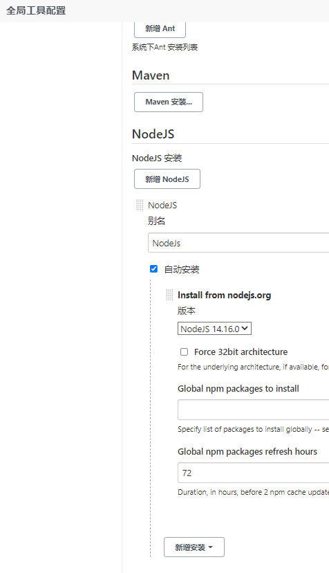
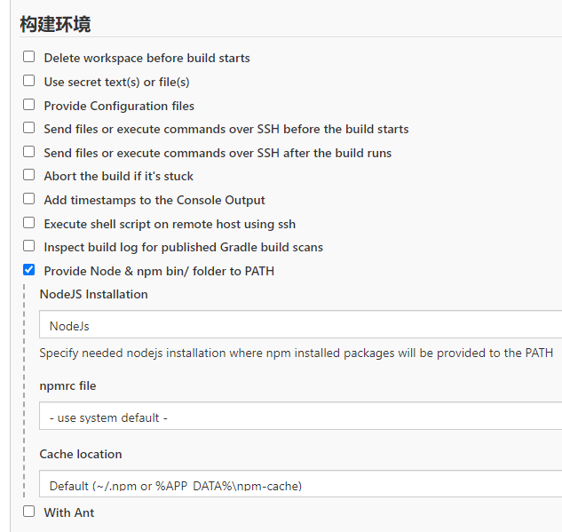
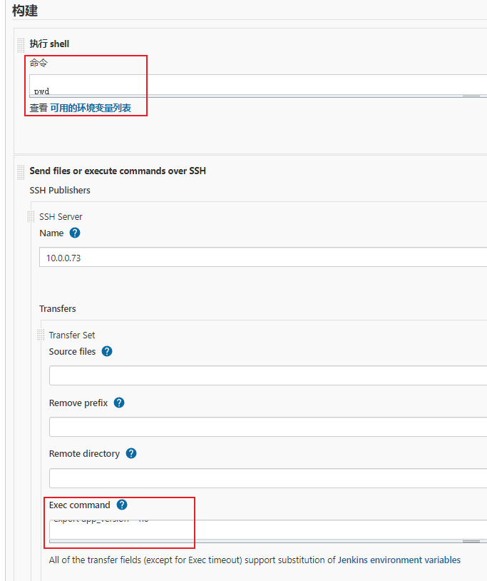

# jenkins构建node项目

## 安装插件

    nodeJs(14.16.0)


## 配置步骤




## 执行shell（在jenkins里执行）

```shell

pwd

# 安装依赖(非必须)
npm --registry https://registry.npmmirror.com/ install
# 构建项目
npm run build:test

# 删除除 node_modules和dist 以外的所有内容
ls | grep -v 'node_modules\|dist' | xargs  rm -rf

```

## Send files or execute commands over SSH(通过ssh远程执行shell)

```shell

export app_version='1.0'

cd $DOCKER_WORKSPACE/$JOB_NAME

mkdir -p ./nginx/conf.d/

# 添加default.conf文件
tee ./nginx/conf.d/default.conf <<-'EOF'
server {
    listen       80;
    listen  [::]:80;
    server_name  localhost;

    #access_log  /var/log/nginx/host.access.log  main;

    location / {
        root   /usr/share/nginx/html;
        index  index.html index.htm;
        try_files $uri $uri/ /index.html; # 用于解决刷新页面后，显示404的问题
    }

}
EOF

# 编辑Dockerfile文件
echo "FROM nginx" > Dockerfile
echo "MAINTAINER Fa" >> Dockerfile
echo "WORKDIR /usr/share/nginx/html" >> Dockerfile
echo "RUN rm -rf *" >> Dockerfile
echo "ADD ./dist ." >> Dockerfile
echo "ADD ./nginx/conf.d/default.conf /etc/nginx/conf.d/" >> Dockerfile
echo "EXPOSE 80" >> Dockerfile

# 构建镜像
docker build --no-cache -t $JOB_NAME:$app_version .

# 上传镜像到私服
docker tag $JOB_NAME:$app_version registry.docker.com:5000/$JOB_NAME:$app_version
docker push registry.docker.com:5000/$JOB_NAME:$app_version

# 删除空镜像
docker images | awk '{if($1=="<none>")print $3}' | xargs docker rmi &> /dev/null

# 编辑stack yml文件
tee $JOB_NAME.yml <<-'EOF'
version: '3.5'
services:
  $JOB_NAME:
    image: registry.docker.com:5000/$JOB_NAME:${app_version}
    ports:
      - target: 80
        published: 3230
        mode: host
    networks:
      - middleware
    deploy:
      replicas: 1
      update_config:
        parallelism: 1
      restart_policy:
        condition: on-failure
networks:
  middleware:
    external: true
EOF

docker stack up -c $JOB_NAME.yml app

# 删除除 node_modules 以外的所有内容
ls | grep -v 'node_modules' | xargs  rm -rf

```
