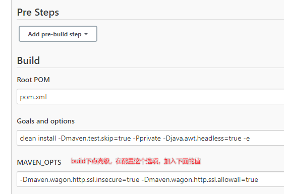

# jenkins部署相关问题记录

## 该jenkins实例似乎已离线

    安装插件那个页面，就是提示你offline的那个页面，不要动。
    然后打开一个新的tab，输入网址http://192.168.211.103:8080/jenkins/pluginManager/advanced。 
    这里面最底下有个【升级站点】，把其中的链接由https改成http的就好了，http://updates.jenkins.io/update-center.json。 
    然后在服务列表中关闭jenkins，再tomcat重新启动，这样就能正常联网了

## 不能下载maven插件依赖

- Could not transfer artifact org.apache.maven.plugins:maven-clean-plugin:pom:2.5 from 这类问题的解决方法
- -Dmaven.wagon.http.ssl.insecure=true -Dmaven.wagon.http.ssl.allowall=true # 在maven_ops中加入该配置即可
- -Dmaven.wagon.http.ssl.insecure=true -Dmaven.wagon.http.ssl.allowall=true -Dmaven.wagon.http.ssl.ignore.validity.dates=true # 未用过
- [参考文章](https://www.cnblogs.com/JavaArchitect/p/14383061.html)



---

## vue项目，刷新页面后，显示404的问题

- try_files $uri $uri/ /index.html; # 用于解决刷新页面后，显示404的问题
- [参考文章](https://www.cnblogs.com/caijinghong/p/14693820.html)

## npm镜像源问题

- <https://registry.npmmirror.com/>(淘宝镜像源)
- <https://registry.npm.taobao.org>(淘宝cnpm镜像源)
- [参考文章](https://cloud.tencent.com/developer/article/1372949)

## Dockerfile给服务器配置文件追加内容

    ```shell

    echo "FROM tomcat:8.5" > Dockerfile
    echo "MAINTAINER Fa" >> Dockerfile
    echo "RUN rm -rf /usr/local/tomcat/webapps/*" >> Dockerfile
    echo "RUN echo '' >> conf/catalina.properties" >> Dockerfile
    echo "RUN echo 'tomcat.util.http.parser.HttpParser.requestTargetAllow=|{}' >> conf/catalina.properties" >> Dockerfile
    echo "RUN echo 'org.apache.tomcat.util.buf.UDecoder.ALLOW_ENCODED_SLASH=true' >> conf/catalina.properties" >> Dockerfile
    echo "ADD ./target/*.war /usr/local/tomcat/webapps/" >> Dockerfile
    echo "EXPOSE 8080" >> Dockerfile
    # echo 'ENTRYPOINT ["/usr/local/tomcat/bin/catalina.sh","run"]' >> Dockerfile

    docker build -t docker-test .

    ```

## Java相关问题

- 异常：org.springframework.web.util.NestedServletException: Handler dispatch failed; nested exception is java.lang.NoClassDefFoundError: Could not initialize class sun.font.SunFontManager
  - 启动java时加上参数:-Djava.awt.headless=true
  - [参考文章](https://www.cnblogs.com/yanqin/p/7160889.html)

- 异常：找不到文件/opt/java/openjdk/lib/libfontmanager.so
  - 11-jre-alpine的docker镜像中找不到这个文件，所以去除-alpine，直接使用11-jre即可
