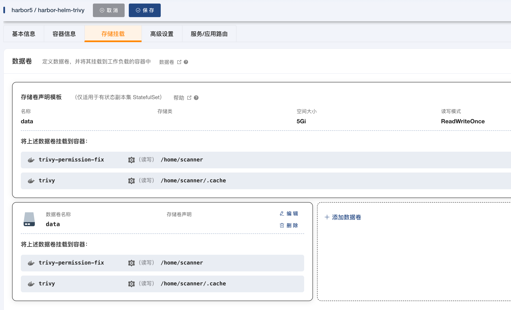

# Harbor使用记录

## 安装

- [官网](https://goharbor.io/docs/2.10.0/install-config/harbor-ha-helm/)
- [values.yaml](https://github.com/goharbor/harbor-helm/blob/main/values.yaml)

```bash
# 创建命名空间
kubectl create namespace harbor
helm repo add harbor https://helm.goharbor.io
helm fetch harbor/harbor --untar
# 安装
helm install harbor-helm harbor/
# 卸载
helm uninstall harbor-helm

# 自定义安装(--set配置参考`values.yaml`)
helm install harbor-helm harbor/harbor \
  --set database.type=external \
  --set database.external.host=10.0.0.11 \
  --set database.external.username=dbadmin \
  --set database.external.password=dbadmin \
  --set redis.type=external \
  --set redis.external.addr=10.0.0.23:6379 \
  --set redis.external.password=foobared \
  --set harborAdminPassword=Harbor12345 \
  --set externalURL=http://core.harbor.domain \
  --set expose.tls.enabled=false \
  --set expose.type=loadBalancer \
  --set ipFamily.ipv6.enabled=false

# 访问, 使用以下命令, 或vscode中使用插件界面中操作代理到本地(admin/Harbor12345)
kubectl port-forward pods/harbor-helm-nginx-cc76b85fb-mzj7z 8080:8080 -n harbor6

# 查看密码, 进入harbor-core的pod中执行命令
printenv |grep PASSWORD

## PS: 查看日志发现, 需要手动创建PersistentVolume
## PS: 查看日志发现(用 kubectl logs <pod name>, 或者vscode插件界面查看), 需要手动创建数据库registry
#    \
#   --set expose.tls.enabled=false

# 更新
helm upgrade --namespace harbor5 harbor-helm harbor/harbor -f ~/harbor/values.yaml

helm upgrade --namespace harbor5 harbor-helm harbor/harbor \
  --set database.type=external \
  --set database.external.host=10.0.0.11 \
  --set database.external.username=dbadmin \
  --set database.external.password=dbadmin \
  --set redis.type=external \
  --set redis.external.addr=10.0.0.23:6379 \
  --set redis.external.password=foobared \
  --set harborAdminPassword=Harbor12345 \
  --set externalURL=http://core.harbor.domain \
  --set expose.tls.enabled=false \
  --set expose.type=loadBalancer \
  --set ipFamily.ipv6.enabled=false

# test示例

# 镜像上传需要harbor-helm-core的pod上传, portal为管理页面 --set externalURL=http://core.harbor.domain.harbor6:8080 \
helm upgrade --namespace harbor6 harbor-helm harbor/harbor \
  --set database.type=external \
  --set database.external.host=10.0.0.11 \
  --set database.external.username=dbadmin \
  --set database.external.password=dbadmin \
  --set redis.type=external \
  --set redis.external.addr=10.0.0.23:6379 \
  --set redis.external.password=foobared \
  --set harborAdminPassword=Harbor12345 \
  --set externalURL=http://core.harbor.domain.harbor6:8080 \
  --set expose.tls.enabled=false \
  --set expose.type=loadBalancer \
  --set ipFamily.ipv6.enabled=false

# test示例二, 配合kt-connect使用  
sudo ktctl connect -n harbor6

# 镜像上传需要harbor-helm-core的pod上传, portal为管理页面 --set externalURL=http://harbor-helm-core.harbor6 \
helm upgrade --namespace harbor6 harbor-helm harbor/harbor \
  --set database.type=external \
  --set database.external.host=10.0.0.11 \
  --set database.external.username=dbadmin \
  --set database.external.password=dbadmin \
  --set redis.type=external \
  --set redis.external.addr=10.0.0.23:6379 \
  --set redis.external.password=foobared \
  --set harborAdminPassword=Harbor12345 \
  --set externalURL=http://harbor-helm-core.harbor6 \
  --set expose.tls.enabled=false \
  --set expose.type=loadBalancer \
  --set ipFamily.ipv6.enabled=false

# 测试连通性
curl http://harbor-helm-core.harbor6/v2/

# test示例三, 配合kt-connect使用  
sudo ktctl connect -n harbor6

helm upgrade --namespace harbor6 harbor-helm harbor/harbor \
  --set database.type=external \
  --set database.external.host=10.0.0.11 \
  --set database.external.username=dbadmin \
  --set database.external.password=dbadmin \
  --set redis.type=external \
  --set redis.external.addr=10.0.0.23:6379 \
  --set redis.external.password=foobared \
  --set harborAdminPassword=Harbor12345 \
  --set externalURL=http://harbor.harbor6 \
  --set expose.tls.enabled=false \
  --set expose.type=loadBalancer \
  --set ipFamily.ipv6.enabled=false

# 测试连通性
curl http://harbor.harbor6/v2/

# ---

# 暴露端口, 会创建个service
kubectl expose deployment harbor-helm-core --port=80 --target-port=8080


```

- 生成ssl

```bash
sudo mkdir -p /etc/harbor/ssl/
openssl req -x509 -nodes -days 365 -newkey rsa:2048 -keyout /etc/harbor/ssl/harbor.key -out /etc/harbor/ssl/harbor.crt
```

```bash
# (参考文章)[https://wghdr.top/?p=3700]

# test示例四, cert-manage自动管理ssl(有点问题)

helm upgrade --namespace harbor6 harbor-helm harbor/harbor \
  --set database.type=external \
  --set database.external.host=10.0.0.11 \
  --set database.external.username=dbadmin \
  --set database.external.password=dbadmin \
  --set redis.type=external \
  --set redis.external.addr=10.0.0.23:6379 \
  --set redis.external.password=foobared \
  --set harborAdminPassword=Harbor12345 \
  --set externalURL=core.harbor.domain \
  --set expose.tls.auto.commonName=letsencrypt-harbor \
  --set expose.ingress.hosts.core=core.harbor.domain \
  --set expose.ingress.annotations.kubernetes.io/tls-acme=true \
  --set expose.ingress.annotations.certmanager.k8s.io/issuer=letsencrypt-harbor

# 检查
kubectl get ing -n harbor6 -o yaml | grep -A 3 tls
kubectl get secret -n harbor6 harbor-ingress -o yaml

# 配置nginx.ingress.kubernetes.io/proxy-body-size=500M, 不然上传镜像可能报错
```

- 创建初始化容器, 给trivy调整文件夹权限

[参考链接](https://github.com/goharbor/harbor-helm/issues/1084)



```bash
initContainers:
  - name: trivy-permission-fix
    securityContext:
      runAsUser: 0  # Run as root user
    image: busybox
    command: ['sh', '-c', 'chown -R 10000:10000 /home/scanner']
    volumeMounts:
    - name: data
      mountPath: /home/scanner

```

- 构建并上传镜像

[demo](https://goharbor.io/docs/2.10.0/install-config/demo-server/)

```bash
# 打标
docker tag SOURCE_IMAGE[:TAG] core.harbor.domain/lx/REPOSITORY[:TAG]
# 推送
docker push core.harbor.domain/lx/REPOSITORY[:TAG]
# 示例
docker login -u admin -p Harbor12345 core.harbor.domain:8080
docker tag app-service:latest core.harbor.domain:8080/lx/app-service:latest
docker push core.harbor.domain:8080/lx/app-service:latest
```

```bash
# 配置本地hosts(code /etc/hosts)
127.0.0.1 harbor.harbor6
# 转发端口到本地(PS: 由于没有kubectl, 用的docker加alias实现的[参考文档](https://github.com/183461750/doc-record/blob/b9d7b122aa78712f6106df23f92518a0bfc199be/k8s/kubectl.md))
kubectl port-forward pods/harbor-helm-nginx-cc76b85fb-mzj7z 80:8080 -n harbor6
docker login -u admin -p Harbor12345 harbor.harbor6
# 拉取镜像
docker pull harbor.harbor6/lx/app-service:latest
```

- k8s中拉取镜像

```bash
# 转发端口
kubectl port-forward pods/harbor-helm-nginx-cc76b85fb-mzj7z 80:8080 -n harbor6
# 配置本地hosts(code /etc/hosts)
127.0.0.1 harbor.harbor6
# 设置不安全容器镜像仓库[参考文档](https://github.com/183461750/doc-record/blob/c80d519ba5e1d55e5ee385a867211800ea118c4b/k8s/crictl.md)
# 拉取镜像
crictl pull harbor.harbor6/lx/app-service:latest
```

- NodePort服务类型的访问
  - 在kuboard中配置


```bash
# 配置本地hosts(code /etc/hosts)(PS: 配置多个IP对应一个域名会随机选择一个IP进行访问)
10.0.1.139 harbor.harbor6
10.0.1.177 harbor.harbor6

```

- 镜像拉取超时的问题

```bash
wget https://github.com/goharbor/harbor/releases/download/v2.9.1/harbor-offline-installer-v2.9.1.tgz
tar xvf harbor-offline-installer-v2.9.1.tgz
cd harbor
nerdctl -n k8s.io load -i harbor.v2.9.1.tar.gz
```
