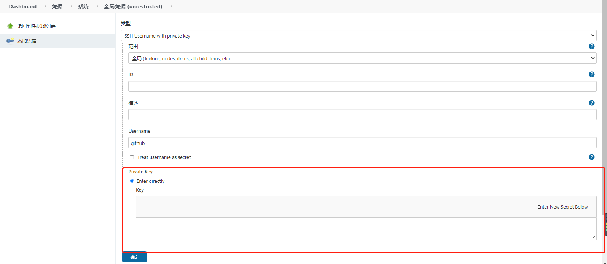

# git通过ssh拉取代码

- 生成公私钥

```shell
ssh-keygen -t rsa -C “123456@qq.com”
```

- 将公钥(id_rsa.pub)配置到github

- 在jenkins中设置全局凭证，类型选择“SSH Username with private key”，将id_rsa文件的内容复制到Private Key中，其他都是非必填选项，这里Username我们填写github


