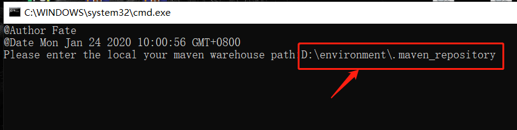

# maven使用记录

## 一键删除maven仓库无效jar包脚本

    delLastUpdated.bat
使用方法：
复制上面文件，双击打开，输入maven仓库的地址或者把仓库的文件夹拖入到命令窗口，在回车即可。


## Maven的-pl用法

- [参考文章](https://blog.csdn.net/zmm0420/article/details/115937027)
- [参考文章](https://blog.csdn.net/wangooo/article/details/109361708)

```shell

clean deploy -Dmaven.test.skip=true -pl project-a (只构建其中一个)
 
clean deploy -Dmaven.test.skip=true -pl project-a,project-b,project-c (只构建其中三个个)

# 示例
mvn clean package -Dmaven.test.skip=true -pl cn.facoder:mall-server -am
```

## 依赖分析

- mvn dependency:analyze
- 可以分析没有用到的依赖有哪些

## jar包瘦身

- [参考文章](https://www.cnblogs.com/ygjlch/p/7767639.html)`主要思想：将依赖放到宿主机上，通过挂载方式加载依赖`
