## 访问地址
```shell
http://ip:9100/metrics( 查看服务器的指标)
http://ip:8899/metrics（查看docker容器的指标）
http://ip:9090/(prometheus的原生web-ui)
http://ip:3000/(Grafana开源的监控可视化组件页面)
```


## Grafana配置监控
- Try it out, default admin user credentials are admin/admin.
- configuration -> base sources -> prometheus
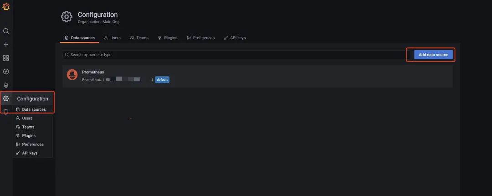
- 配置url: http://prometheus:9090
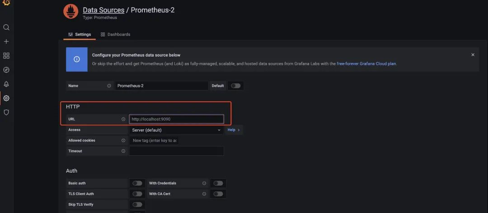
- import对应的模板，相关的模板可以在 https://grafana.com/grafana/dashboards/ 这里查到。
- create -> import -> 8913
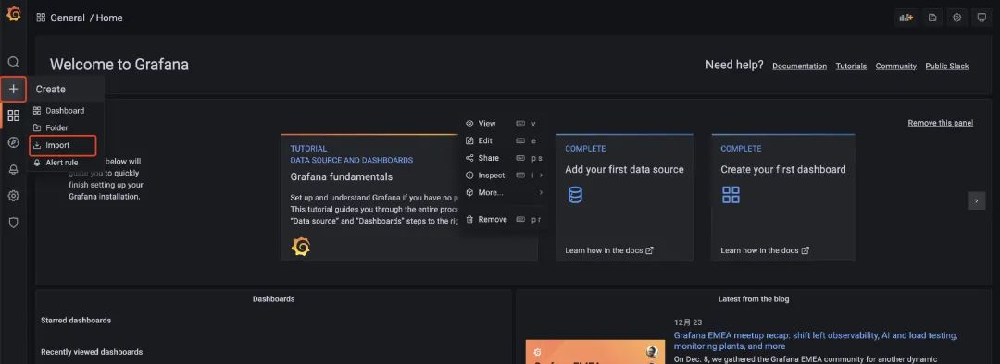
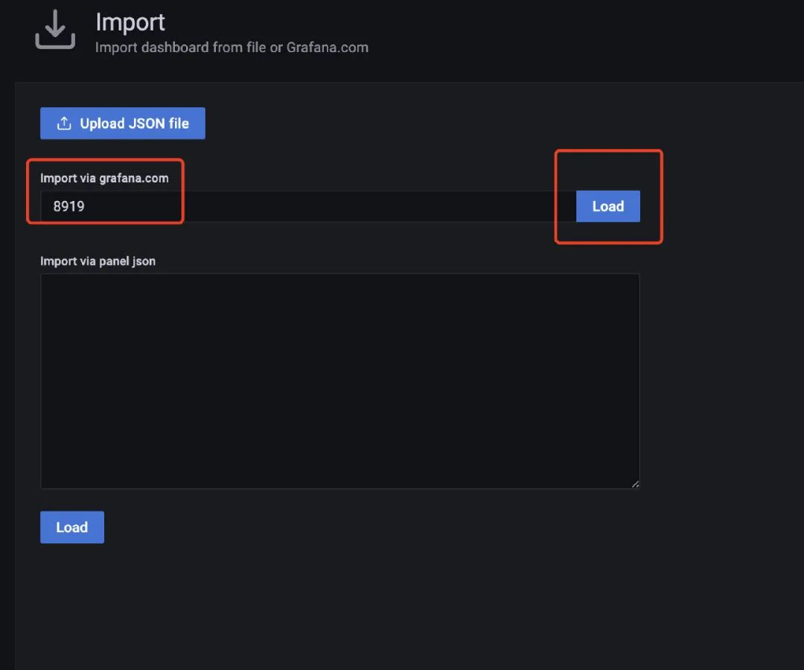
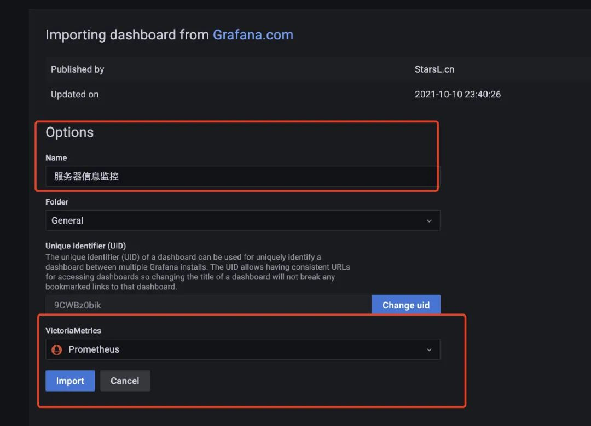  
- 我们用docker启动的服务还是蛮多的，也可以看看Docker的监控（上面启动的cadvisor服务就采集了Docker的信息），我们使用模板893来配置监控docker的信息：
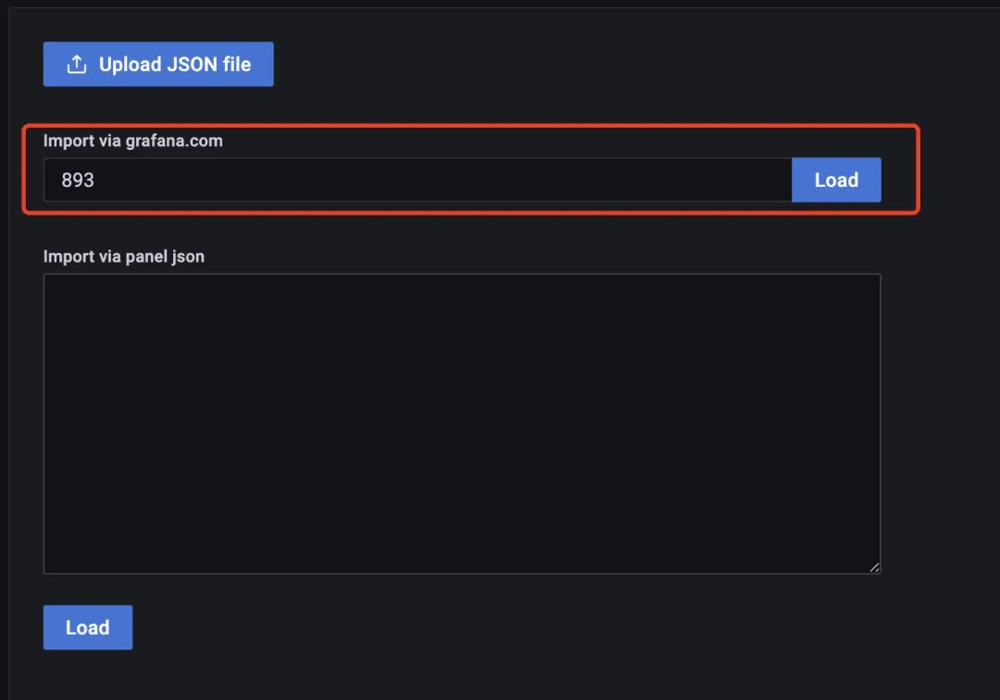

## Java系统指标
- 在项目中多引入两个pom依赖
```xml
<!--监控-->
<dependency>
  <groupId>org.springframework.boot</groupId>
  <artifactId>spring-boot-starter-actuator</artifactId>
</dependency>
<!--适配prometheus-->
<dependency>
  <groupId>io.micrometer</groupId>
  <artifactId>micrometer-registry-prometheus</artifactId>
</dependency>
```
- 然后在配置文件上加上对应的配置（开启监控并可以让prometheus拉取配置）
```yaml
# 监控配置  TODO
management:
  endpoint:
    health:
      show-details: always
    metrics:
      enabled: true
    prometheus:
      enabled: true
  endpoints:
    web:
      exposure:
        include: '*'
  metrics:
    export:
      prometheus:
        enabled: true
```
- 启动服务后，访问/actuator路径就能看到一大堆输出的指标了，包括prometheus的
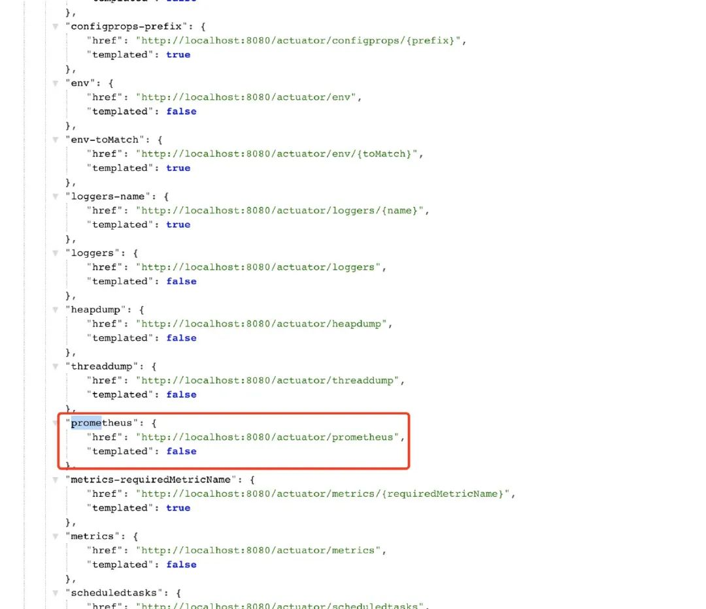
- 在前面写好的的prometheus.yml文件下添加相关的配置信息：
```yaml
  - job_name: 'austin'
    metrics_path: '/actuator/prometheus' # 采集的路径
    static_configs:
    - targets: ['ip:port'] # todo 这里的ip和端口写自己的应用下的
```
- 访问：ip:9090/targets这个路径下，能看到现在prometheus能采集到的端点有哪些，看到都是自己所配置的状态为up，那就说明正常了。
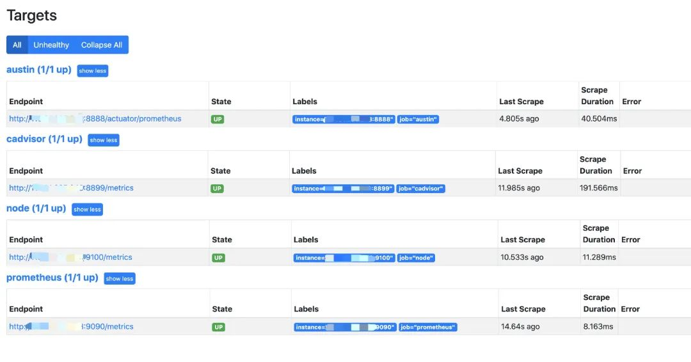
- 选用了4701模板的JVM监控和12900SpringBoot监控
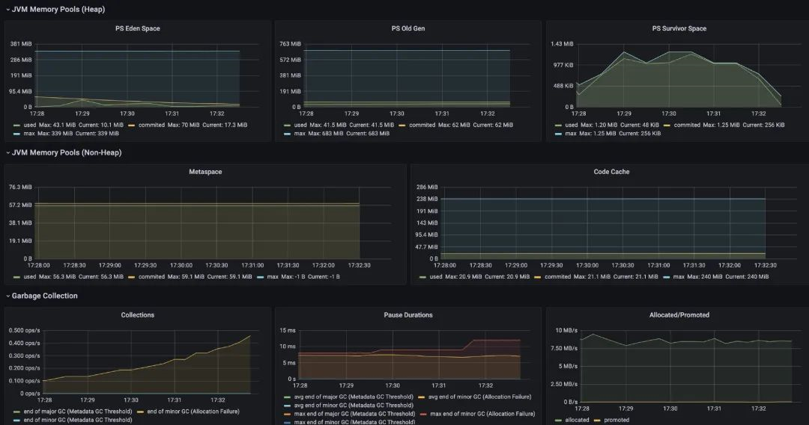
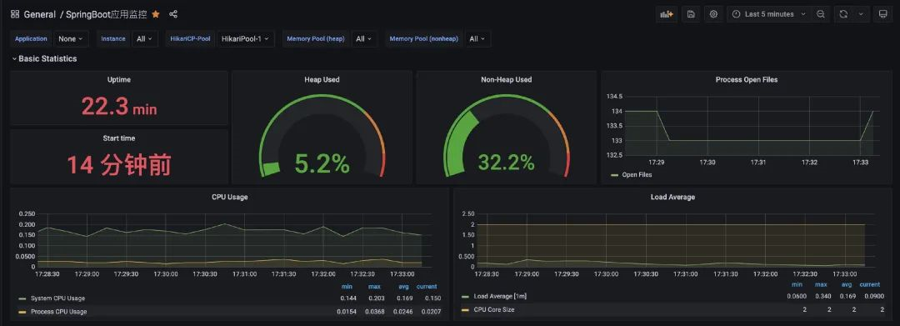
- 业务指标

- 总结
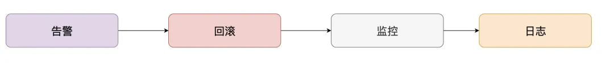
