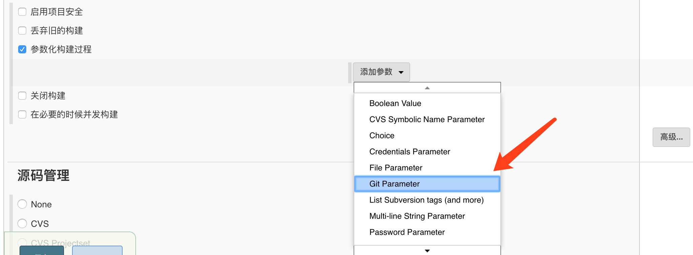
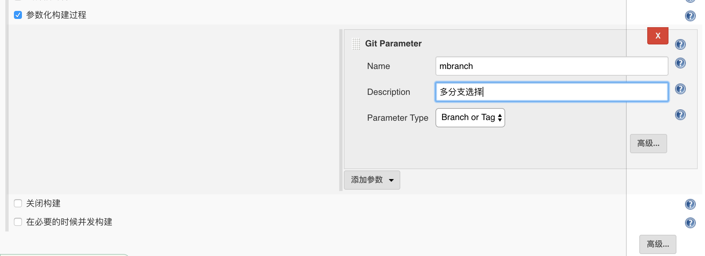
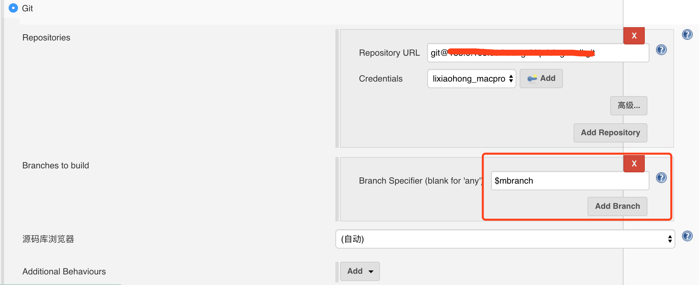

## maven配置settings.xml
```shell
docker volume ls
docker volume inspect jenkins_jenkins_home
cd /var/lib/docker/volumes/jenkins_jenkins_home/_data
mkdir -p ./data/maven
code settings.xml
# 复制./conf/settings.xml文件内容
# 修改标签<localRepository>内容
```
---
## 多分支参数构建
```shell
# 1. 下载安装插件
# 在管理中选插件，输入Git Parameter
```



--- 
