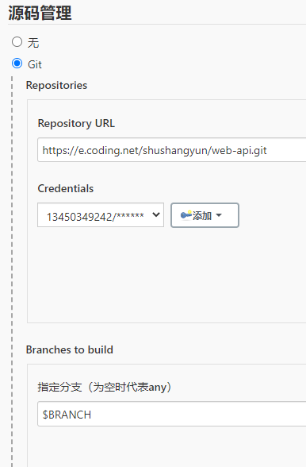
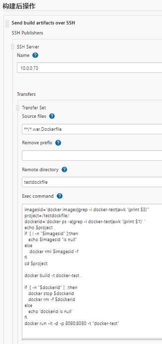

## maven配置settings.xml
```shell
docker volume ls
docker volume inspect jenkins_jenkins_home
cd /var/lib/docker/volumes/jenkins_jenkins_home/_data
mkdir -p ./data/maven
code settings.xml
# 复制./conf/settings.xml文件内容
# 修改标签<localRepository>内容
```
---
## 多分支参数构建
```shell
# 1. 下载安装插件
# 在管理中选插件，输入Git Parameter
```


--- 
## 构建maven项目
```shell
# 下载安装插件
# 在管理中选插件，输入
# Maven Integration
# SSH
# Deploy to container 
# Send build artifacts over SSH
```
- 步骤
    
    
    
    
    
- send build artifacts over SSH (Transfers Set -> Exec command)
```shell
imagesid=`docker images|grep -i docker-test|awk '{print $3}'`
project=/var/lib/docker/volumes/jks_jenkins_home/_data/workspace/test4
dockerid=`docker ps -a|grep -i docker-test|awk '{print $1}' `
echo $project
if  [ ! -n "$imagesid" ];then
   echo $imagesid "is null"
else
    docker rmi $imagesid -f
fi
cd $project

echo "FROM tomcat:8.5" > Dockerfile
echo "MAINTAINER Fa" >> Dockerfile
echo "RUN rm -rf /usr/local/tomcat/webapps/*" >> Dockerfile
echo "ADD ./target/*.war /usr/local/tomcat/webapps/" >> Dockerfile
echo "EXPOSE 8080" >> Dockerfile
# echo 'ENTRYPOINT ["/usr/local/tomcat/bin/catalina.sh","run"]' >> Dockerfile

docker build -t docker-test .

if  [ -n "$dockerid" ]  ;then
   docker stop $dockerid
   docker rm -f $dockerid
else
   echo 'dockerid is null'
fi
docker run -itd -p 8080:8080 docker-test
```