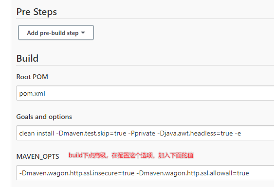

## 该jenkins实例似乎已离线
    安装插件那个页面，就是提示你offline的那个页面，不要动。
    然后打开一个新的tab，输入网址http://192.168.211.103:8080/jenkins/pluginManager/advanced。 
    这里面最底下有个【升级站点】，把其中的链接由https改成http的就好了，http://updates.jenkins.io/update-center.json。 
    然后在服务列表中关闭jenkins，再tomcat重新启动，这样就能正常联网了

## 不能下载maven插件依赖
- Could not transfer artifact org.apache.maven.plugins:maven-clean-plugin:pom:2.5 from 这类问题的解决方法
- -Dmaven.wagon.http.ssl.insecure=true -Dmaven.wagon.http.ssl.allowall=true # 在maven_ops中加入该配置即可
- -Dmaven.wagon.http.ssl.insecure=true -Dmaven.wagon.http.ssl.allowall=true -Dmaven.wagon.http.ssl.ignore.validity.dates=true # 未用过
- [参考文章](https://www.cnblogs.com/JavaArchitect/p/14383061.html)

  
---