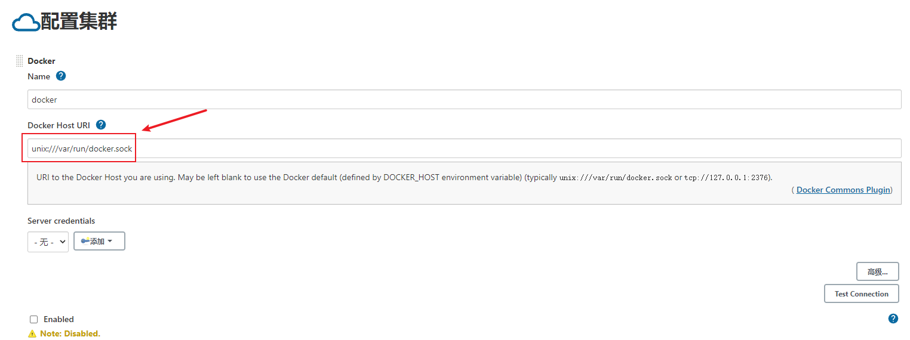
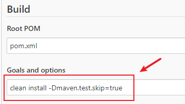
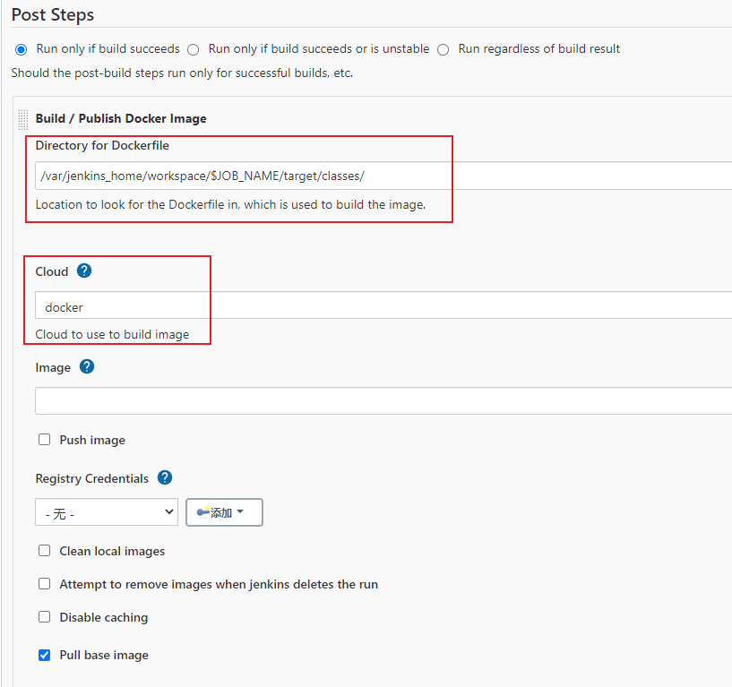

## springboot pom.xml配置
```xml
            <!-- Docker maven plugin start -->
            <plugin>
                <groupId>com.spotify</groupId>
                <artifactId>docker-maven-plugin</artifactId>
                <version>0.4.13</version>
                <configuration>
                    <imageName>demo</imageName><!--[a-z 0-9] 不然docker:build会报错-->
                    <dockerDirectory>${project.basedir}/src/main/docker</dockerDirectory>
                    <resources>
                        <resource>
                            <targetPath>/</targetPath>
                            <directory>${project.build.directory}</directory>
                            <include>${project.build.finalName}.jar</include>
                        </resource>
                    </resources>
                </configuration>
            </plugin>
            <!-- Docker maven plugin end -->
```
## docker.sh
```shell
mvn clean package  docker:build
echo "当前docker 镜像："
docker images | grep demo
echo "启动容器----->"
docker run -p 8001:8001 -d demo
echo "启动服务成功！"
```
## Dockerfile 
```shell
#FROM openjdk:8-jdk-alpine
FROM hub.c.163.com/dwyane/openjdk:8
VOLUME /tmp
ADD docker-springboot-1.0-SNAPSHOT.jar app.jar
ENTRYPOINT ["java","-Djava.security.egd=file:/dev/./urandom","-jar","/app.jar"]
```
## jenkins 安装docker插件
- docker插件配置[系统管理->系统配置->Cloud]
- 配置docker host URI [unix:///var/run/docker.sock]
> (typically unix:///var/run/docker.sock or tcp://127.0.0.1:2376)


## 新建maven项目配置

