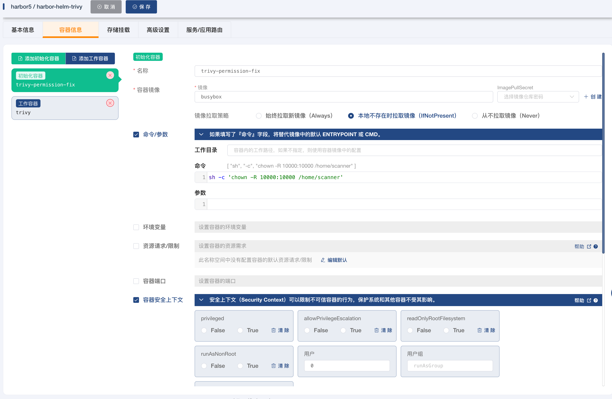
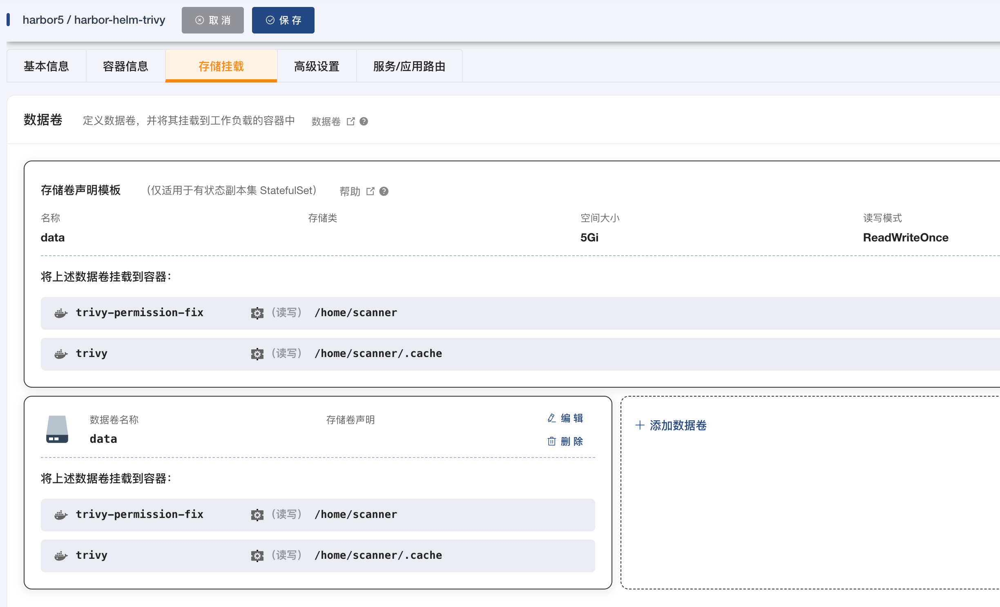

# Harbor使用记录

## 安装

- [官网](https://goharbor.io/docs/2.10.0/install-config/harbor-ha-helm/)
- [values.yaml](https://github.com/goharbor/harbor-helm/blob/main/values.yaml)

```bash
# 创建命名空间
kubectl create namespace harbor
helm repo add harbor https://helm.goharbor.io
helm fetch harbor/harbor --untar
# 安装
helm install harbor-helm harbor/
# 卸载
helm uninstall harbor-helm

# 自定义安装(--set配置参考`values.yaml`)
helm install harbor-helm harbor/harbor \
  --set database.type=external \
  --set database.external.host=10.0.0.11 \
  --set database.external.username=dbadmin \
  --set database.external.password=dbadmin \
  --set redis.type=external \
  --set redis.external.addr=10.0.0.23:6379 \
  --set redis.external.password=foobared

## PS: 查看日志发现(用 kubectl logs <pod name>, 或者vscode插件界面查看), 需要手动创建数据库registry
#    \
#   --set expose.tls.enabled=false

```

- 生成ssl

```bash
sudo mkdir -p /etc/harbor/ssl/
openssl req -x509 -nodes -days 365 -newkey rsa:2048 -keyout /etc/harbor/ssl/harbor.key -out /etc/harbor/ssl/harbor.crt
```

- 创建初始化容器, 给trivy调整文件夹权限

[参考链接](https://github.com/goharbor/harbor-helm/issues/1084)



```bash
initContainers:
  - name: trivy-permission-fix
    securityContext:
      runAsUser: 0  # Run as root user
    image: busybox
    command: ['sh', '-c', 'chown -R 10000:10000 /home/scanner']
    volumeMounts:
    - name: data
      mountPath: /home/scanner

```
